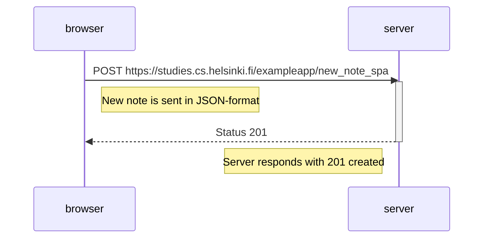

```mermaid
sequenceDiagram
    participant browser
    participant server

    browser->>server: POST https://studies.cs.helsinki.fi/exampleapp/new_note_spa
    activate server
    Note right of browser: New note is sent in JSON-format
    server-->>browser:  Status 201
    deactivate server

    Note left of server: Server responds with 201 created
```
